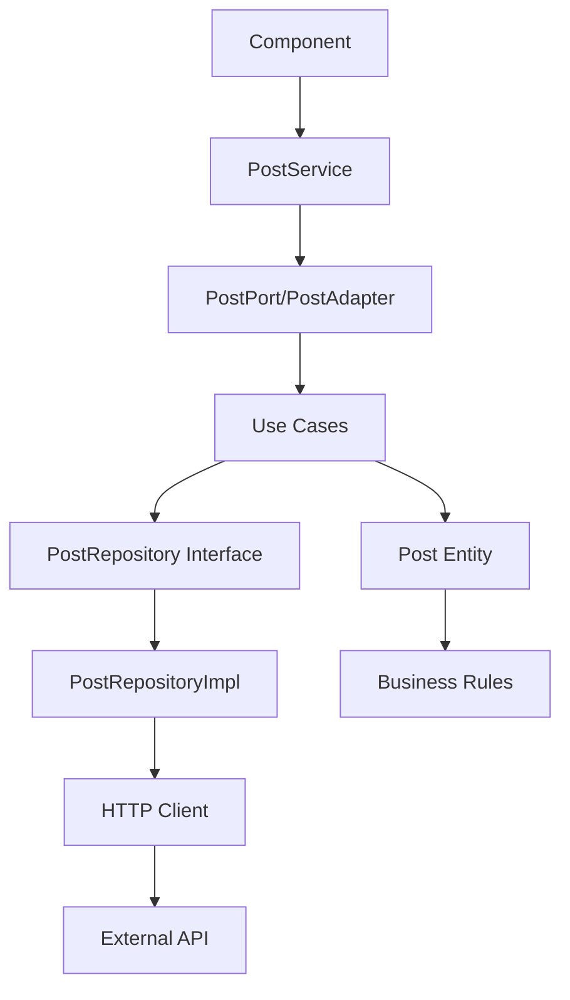

# CRUD Angular com Arquitetura Hexagonal

Este projeto implementa um sistema CRUD de posts utilizando a **Arquitetura Hexagonal** (Ports and Adapters) em Angular, demonstrando como organizar código frontend de forma escalável e testável.

## 🏗️ Arquitetura Hexagonal no Frontend

A arquitetura hexagonal organiza o código em camadas concêntricas, onde o **domínio** fica no centro, isolado de dependências externas. No frontend, isso significa separar regras de negócio da lógica de apresentação e infraestrutura.

### Estrutura do Projeto

```
src/app/
├── core/                           # 🎯 Núcleo da aplicação
│   ├── domain/                    # Regras de negócio puras
│   │   ├── entities/              # Entidades do domínio
│   │   └── repositories/          # Interfaces dos repositórios
│   ├── application/               # Casos de uso e orquestração
│   │   ├── adapters/             # Adaptadores que implementam ports
│   │   ├── dtos/                 # Data Transfer Objects
│   │   ├── ports/                # Interfaces (contratos)
│   │   ├── services/             # Serviços de aplicação
│   │   └── use-cases/            # Casos de uso específicos
│   ├── infrastructure/           # Implementações técnicas
│   │   ├── config/               # Configuração de DI
│   │   ├── interceptors/         # Interceptadores HTTP
│   │   └── repositories/         # Implementações dos repositórios
│   ├── presentation/             # Interface do usuário
│   │   └── features/             # Componentes e módulos
│   └── core.module.ts            # Módulo principal do core
├── shared/                        # 🔧 Componentes compartilhados
│   ├── components/               # Componentes reutilizáveis
│   ├── services/                 # Serviços compartilhados
│   └── shared.module.ts          # Módulo compartilhado
└── app.module.ts                 # Módulo raiz da aplicação
```

## 📋 Camadas da Arquitetura

### 1. **Domain Layer** (Domínio)
**Localização**: `core/domain/`

Contém as regras de negócio puras, sem dependências externas.

#### Entidades
```typescript
// base.entity.ts
export abstract class BaseEntity {
  public readonly id: string;
  public readonly createdAt: Date;
  public readonly updatedAt: Date;
  
  public abstract equals(entity: BaseEntity): boolean;
}

// post.entity.ts
export class Post extends BaseEntity {
  public readonly title: string;
  public readonly body: string;
  public readonly userId: number;

  public updateTitle(newTitle: string): Post { /* regras de negócio */ }
  public updateBody(newBody: string): Post { /* regras de negócio */ }
}
```

#### Repositórios (Interfaces)
```typescript
// post.repository.interface.ts
export interface PostRepository {
  findById(id: string): Promise<Post | null>;
  findAll(): Promise<Post[]>;
  save(post: Post): Promise<Post>;
  update(post: Post): Promise<Post>;
  delete(id: string): Promise<void>;
}
```

### 2. **Application Layer** (Aplicação)
**Localização**: `core/application/`

Orquestra os casos de uso e define contratos para comunicação.

#### Use Cases
```typescript
// create-post.use-case.ts
@Injectable()
export class CreatePostUseCase {
  constructor(@Inject(POST_REPOSITORY_TOKEN) private postRepository: PostRepository) {}

  async execute(createPostDto: CreatePostDto): Promise<Post> {
    // Validações de negócio
    if (!createPostDto.title?.trim()) {
      throw new Error('Title is required');
    }
    
    // Criação da entidade
    const post = new Post(/* ... */);
    
    // Persistência
    return await this.postRepository.save(post);
  }
}
```

#### Ports (Contratos)
```typescript
// post.port.ts
export interface PostPort {
  createPost(createPostDto: CreatePostDto): Promise<Post>;
  getPostById(id: string): Promise<Post | null>;
  getAllPosts(): Promise<Post[]>;
  updatePost(id: string, updatePostDto: UpdatePostDto): Promise<Post>;
  deletePost(id: string): Promise<void>;
}
```

#### Adapters
```typescript
// post.adapter.ts
@Injectable()
export class PostAdapter implements PostPort {
  constructor(
    private createPostUseCase: CreatePostUseCase,
    private getAllPostsUseCase: GetAllPostsUseCase
    // ... outros use cases
  ) {}

  async createPost(createPostDto: CreatePostDto): Promise<Post> {
    return await this.createPostUseCase.execute(createPostDto);
  }
}
```

### 3. **Infrastructure Layer** (Infraestrutura)
**Localização**: `core/infrastructure/`

Implementa as interfaces definidas nas camadas internas.

#### Repository Implementation
```typescript
// post.repository.impl.ts
@Injectable()
export class PostRepositoryImpl implements PostRepository {
  private readonly baseUrl = 'https://jsonplaceholder.typicode.com/posts';

  constructor(private http: HttpClient) {}

  async findAll(): Promise<Post[]> {
    return this.http.get<PostApiResponse[]>(this.baseUrl)
      .pipe(map(apiResponses => apiResponses.map(this.mapApiResponseToEntity)))
      .toPromise();
  }
}
```

#### Dependency Injection
```typescript
// dependency-injection.config.ts
export const CORE_PROVIDERS: Provider[] = [
  { provide: POST_REPOSITORY_TOKEN, useClass: PostRepositoryImpl },
  { provide: POST_PORT_TOKEN, useClass: PostAdapter }
];
```

### 4. **Presentation Layer** (Apresentação)
**Localização**: `core/presentation/` e `shared/`

Interface do usuário que consome os serviços da aplicação.

#### Service Layer
```typescript
// post.service.ts
@Injectable()
export class PostService {
  constructor(@Inject(POST_PORT_TOKEN) private postPort: PostPort) {}

  createPost(createPostDto: CreatePostDto): Observable<PostDto> {
    return from(this.postPort.createPost(createPostDto).then(post => this.postToDto(post)));
  }
}
```

#### Components
```typescript
// list.component.ts
@Component({
  selector: 'app-list',
  templateUrl: './list.component.html'
})
export class ListComponent implements OnInit {
  constructor(private postService: PostService) {}

  public loadPosts(): void {
    this.postService.getAllPosts().subscribe({
      next: (posts) => this.posts = posts,
      error: (error) => this.handleError(error)
    });
  }
}
```

## 🔄 Fluxo de Dados



## 🎯 Benefícios no Frontend

### 1. **Separação de Responsabilidades**
- Regras de negócio isoladas do UI
- Lógica de apresentação separada da lógica de negócio
- Código mais organizado e manutenível

### 2. **Testabilidade Superior**
- Cada camada pode ser testada independentemente
- Mocks fáceis via Dependency Injection
- Cobertura de testes mais eficiente

### 3. **Flexibilidade para Mudanças**
- Trocar de framework sem afetar regras de negócio
- Diferentes interfaces usando a mesma lógica
- APIs externas podem mudar sem quebrar o core

### 4. **Reutilização de Código**
- Lógica de negócio reutilizável
- Componentes modulares e independentes
- Fácil manutenção em equipes grandes

## 🧪 Testes

O projeto está configurado para usar **Jest** com **100% de cobertura**:

```bash
# Executar testes
npm test

# Executar testes com cobertura
npm run test:coverage
```

### Estrutura de Testes
- **Unit Tests**: Cada camada testada isoladamente
- **Integration Tests**: Testes entre camadas
- **E2E Tests**: Testes end-to-end

## 🚀 Como Executar

```bash
# Instalar dependências
npm install

# Executar em modo de desenvolvimento
ng serve

# Build para produção
ng build --prod

# Executar testes
npm test
```

## 📁 Módulos Angular

### CoreModule
```typescript
@NgModule({
  providers: [
    ...CORE_PROVIDERS,
    PostService,
    PostAdapter,
    { provide: HTTP_INTERCEPTORS, useClass: ErrorInterceptor, multi: true }
  ]
})
export class CoreModule {
  constructor(@Optional() @SkipSelf() parentModule: CoreModule) {
    if (parentModule) {
      throw new Error('CoreModule já foi carregado. Import apenas no AppModule.');
    }
  }
}
```

### PostModule (Feature Module)
```typescript
@NgModule({
  declarations: [ListComponent, ItemComponent, FormComponent, EditComponent, ModalComponent],
  imports: [CommonModule, FormsModule, ReactiveFormsModule, RouterModule.forChild(routes), SharedModule],
  providers: [] // PostService fornecido pelo CoreModule
})
export class PostModule { }
```

### SharedModule
```typescript
@NgModule({
  declarations: [HeaderMenuComponent, ToastComponent, SkeletonComponent, PostSkeletonComponent],
  providers: [ToastService],
  exports: [/* componentes compartilhados */]
})
export class SharedModule { }
```

## 🔧 Configurações

### Error Handling
```typescript
@Injectable()
export class ErrorInterceptor implements HttpInterceptor {
  intercept(req: HttpRequest<any>, next: HttpHandler): Observable<HttpEvent<any>> {
    return next.handle(req).pipe(
      catchError((error: HttpErrorResponse) => {
        // Tratamento global de erros
        return throwError(() => error);
      })
    );
  }
}
```

### Toast Service
```typescript
@Injectable()
export class ToastService {
  private toasts: Toast[] = [];
  private toastSubject = new BehaviorSubject<Toast[]>([]);
  
  public showSuccess(message: string): void { /* ... */ }
  public showError(message: string): void { /* ... */ }
}
```

## 📚 Padrões Utilizados

1. **Repository Pattern**: Abstração da camada de dados
2. **Use Case Pattern**: Encapsulamento de regras de negócio
3. **Adapter Pattern**: Adaptação entre interfaces
4. **DTO Pattern**: Transferência de dados entre camadas
5. **Dependency Injection**: Inversão de controle
6. **Observer Pattern**: Reatividade com RxJS
7. **Module Pattern**: Organização de funcionalidades

## 🎨 Componentes da UI

### Lista de Posts
- Paginação com "Load More"
- Skeleton loading
- Tratamento de erros
- Toast notifications

### Formulários
- Validação reativa
- Feedback visual
- Estados de loading

### Modais
- Edição inline
- Confirmação de ações
- Responsividade

## 🔍 Exemplo de Uso

```typescript
// No componente
export class PostListComponent {
  constructor(private postService: PostService) {}

  public createPost(postData: CreatePostDto): void {
    this.postService.createPost(postData).subscribe({
      next: (post) => {
        this.posts.unshift(post);
        this.toastService.showSuccess('Post criado com sucesso!');
      },
      error: (error) => this.toastService.showError('Erro ao criar post');
    });
  }
}
```

## 🎯 Conclusão

Esta implementação demonstra como a arquitetura hexagonal pode ser aplicada no frontend, resultando em:

- **Código mais limpo e organizado**
- **Fácil manutenção e evolução**
- **Alta testabilidade**
- **Flexibilidade para mudanças**
- **Separação clara de responsabilidades**

A arquitetura hexagonal não é apenas para backend - ela transforma a forma como construímos aplicações frontend robustas e escaláveis! 🚀
